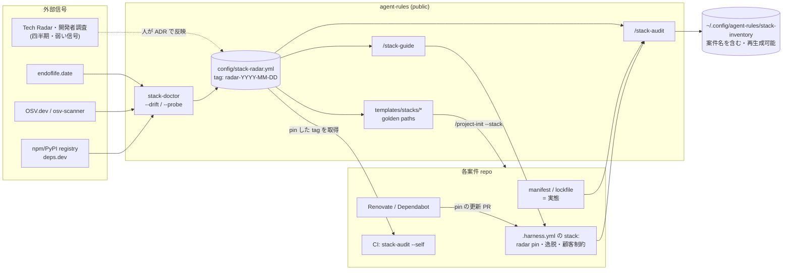

# 技術スタック・ガバナンス: 指標・設計支援・導入支援

- Linear: AGENT-25
- ステータス: 起草 (2026-09-14) — `/deepseek-redteam` 反映済み (§11)。**2026-09-18 に [harness-architecture.md](harness-architecture.md) の「スタック Profile」へ統合**し、宣言は `.harness.yml` の `stack:` セクションに移した (Fable レビュー E 群を反映)
- 関連 ADR: 起票時に採番 / 前提 [ADR-0013](../adr/0013-three-layer-knowledge-architecture.md) [ADR-0017](../adr/0017-ai-workflow-model-refresh-and-review-layers.md) [ADR-0018](../adr/0018-port-inventory-and-registry.md) [ADR-0020](../adr/0020-parallel-exploration-and-scoring-oracle.md)

## 1. 背景

案件ごとにアーキテクチャやフレームワークが違うこと自体は正当である (要件・顧客指定・時期が違う)。問題は **違いに理由が残っていない**ことと、**古くなったことに誰も気づかない**ことにある。

### 1-1. 実測ベースライン (2026-09-14・ローカル clone 約 75 リポを走査)

案件名は public repo に置かないため件数のみ記す。

| 観点 | 実態 |
|---|---|
| 依存更新 bot (Renovate/Dependabot) | **約 75 リポ中 3 件** |
| Next.js | 16 系が多数派だが **14 系が 5 リポ** (うち React 18 併用が複数) |
| 同カテゴリ内の分散 | ORM: Prisma 5/6/7 と Drizzle / テスト: vitest 2・4 と jest 29・30 / Tailwind 3・4 / パッケージマネージャ: npm・pnpm・yarn (1 リポ内で混在あり) |
| バージョン未固定 | `"drizzle-orm": "latest"` のような範囲指定が存在 |
| Python | uv + ruff + pytest + FastAPI/Pydantic で**既に事実上統一** |
| 構成パターン | 「FastAPI backend + Vite/React SPA frontend」の monorepo が複数案件で自然発生 |
| ホスティング | 走査対象は**すべて GitHub** (GitLab 等は現状 0 件) |

**走査自体の教訓**: ルート直下の manifest だけ見ると monorepo のサブディレクトリ (`frontend/`・`apps/*`) を丸ごと見落とし、Next 14 の件数を過少に数えた。検出器は monorepo を前提にする (§7 AC-4)。

### 1-2. 既存の仕組みとの対応

新しい概念を発明せず、本リポで実証済みの型に載せる。

| 必要なもの | 流用する型 | 実証元 |
|---|---|---|
| 判断基準の単一ソース | 台帳 + drift 検査 + 上流 probe | `config/models.yml` + `model-doctor.sh` (ADR-0017) |
| 案件横断の実態把握 | 実態の逆引きを一次情報・台帳は補助・結果はローカル | `/ports` (ADR-0018) |
| 初期構成の展開 | L2 資産をコピー展開 | `/project-init` (ADR-0013) |
| 正典 → 案件の一方向反映 | 正典 + pin + `verify()` | design-system-platform (ADR-0022) |

## 2. 目標と非目標

### 目標
1. **指標**: 案件ごとに「安全か (EOL・脆弱性)」「新鮮か」「逸脱に理由があるか」を機械で判定できる
2. **更新**: 市場トレンドとセキュリティ事象を、推奨 (radar) に**適時・根拠付きで**反映できる
3. **設計支援**: 新規案件の技術選定で、推奨構成と逸脱時の記録 (ADR) を AI が下書きする
4. **導入支援**: 推奨構成で新規案件を立ち上げられ、既存案件には移行計画を出せる

### 非目標
- 全案件を同一スタックに揃えること (統一度そのものは目標にしない)
- **既存案件の CI を落とすこと** (決定 1: 既存は報告のみ。🔴 も警告であって fail ではない)
- 顧客が指定した技術の是非を問うこと (決定 2: 顧客制約は逸脱扱いしない。ただし件数は常に見せる)
- Backstage 等のポータル構築 (§9 代替案 A)
- GitHub 以外のホスティング (実態 0 件。現れたら再検討)
- 複数マシン間での監査結果の共有 (ADR-0013 の昇格台帳と同じく単一マシン運用が前提。§4-8)

## 3. 原則

1. **測るのは「統一度」ではなく「理由のない逸脱」と「期限切れ」**。Hold の技術を使っていても、ADR か顧客制約で理由が残っていれば負債ではなく選択である
2. **実態を一次情報にする**。宣言ファイルは補助。バージョン判定は **lockfile の実体**を正とし、manifest の範囲は「範囲が広すぎる」別指標で見る (ports の bind/hint 区別と同型)
3. **判断の単一ソースは台帳**。スキル・テンプレ・CI にバージョン番号を直書きしない (モデル ID と同じ規律)
4. **情報源が欠けたら成功扱いにしない**。endoflife.date や OSV に到達できないときに「脆弱性 0 件」を返さない。「不明」と表示し、**不明が続くこと自体を 🔴 として検知する** (frontier-usage の jq abort で予算ガードが 10 倍過少報告した事故と同型)
5. **単一の合成スコアを作らない**。軸ごとのベクトルで報告する。合成すると「脆弱性 1 件」が「適合度の高さ」で打ち消されて見えなくなる
6. **機械は提案、人が決める**。ring の変更は ADR を伴う人の判断。トレンド信号は弱い信号なので自動で ring を動かさない
7. **機密分離**。radar (技術名のみ) は public repo。案件名を含む監査結果はローカル (`~/.config/agent-rules/`)
8. **🟡 はすべて「理由の記録」で消せる。記録の無い免除は無い**。警告疲れで仕組みが捨てられるのを防ぎつつ、免除 (顧客制約・移行中) には必ず参照先と期限を要求する
9. **台帳の更新は案件側の pin を上げるまで効かない**。radar の閾値変更で既存の CI が突然赤くならない

## 4. 構成要素



### 4-1. Radar 台帳 `config/stack-radar.yml`

ring は Thoughtworks Technology Radar に倣う 4 段 + `retire`。**意味を「新規案件で選んでよいか」に固定する** (既存案件への作用は §4-3 で別に定義)。

| ring | 新規案件での扱い |
|---|---|
| `adopt` | 既定で選ぶ。golden path に入る |
| `trial` | 選んでよい。案件 ADR に採用理由を 1 行 |
| `assess` | PoC・社内ツールのみ。顧客案件で選ぶなら逸脱 ADR |
| `hold` | 選ばない。選ぶなら逸脱 ADR (理由・代替案・出口・`review_by`) |
| `retire` | 選べない。既存案件にあれば移行計画の対象 |

```yaml
updated: 2026-09-14
review_by: 2026-12-15          # 四半期見直し。過ぎたら /status が警告

categories: [runtime, frontend-framework, ui, css, backend-framework, orm, test, e2e, package-manager, lint, hosting]

entries:
  - key: nextjs
    category: frontend-framework
    detect: { npm: next }                 # 実態検出キー
    signals: { endoflife: nextjs, npm: next }
    rings:                                # バージョン帯ごとに ring を持てる
      - { range: ">=16", ring: adopt }
      - { range: "<15",  ring: hold, reason: "サポート外 (probe で確定)" }
    adr: null                             # ring を決めた ADR (hold/retire では必須)
    golden_paths: [web-next]
```

- **バージョン帯ごとの ring** にするのは、実態の問題の大半が「技術の選択」ではなく「同じ技術の古い major」だから (Next 14 / React 18 / Tailwind 3)
- 最新版番号や EOL 日は**台帳に書かない** (probe が毎回取る。書くと腐る)
- radar を変更する PR が main に入ったら **`radar-YYYY-MM-DD` tag を打つ**。案件はこの tag を pin する (§4-2・原則 9)

### 4-2. 案件の宣言 (`.harness.yml` の `stack:` セクション)

宣言ファイルは [harness-architecture.md §4](harness-architecture.md) の `.harness.yml` に統合した (`.stack.yml` は作らない)。stack に関わる部分:

```yaml
harness: 1
sensitivity: internal
stack:
  radar: radar-2026-09-14          # pin する radar の tag。判定はこの版の radar で行う (ハーネス本体の版 pin とは別キー・harness §9-2)
  gate: enforce                    # enforce = 関門あり (新規) / report = 報告のみ (既存)
  kind: client                     # client = 顧客案件 (既定) / internal = 社内ツール・PoC。assess の扱いが変わる (§4-1)
  golden_path: spa-vite-fastapi    # 無ければ null
  constraints:                     # 顧客指定。C 軸の逸脱から外す (S/F 軸は見る)
    - scope: backend-framework
      reason: client-mandated
      ref: "契約 or 議事録 or Issue の参照 (URL か文書 ID。本文は書かない)"   # 必須
      review_by: 2027-03-01                                                    # 必須
  deviations:                      # hold/assess/未登録を選んだ理由、または移行中
    - { key: express, kind: choice,    adr: docs/adr/0004-keep-express.md, review_by: 2027-03-01 }
    - { key: jest,    kind: migrating, ref: "Issue URL", review_by: 2026-11-30 }
```

**免除の規律 (原則 8)**:
- `constraints` と `deviations` は `ref`/`adr` と `review_by` が**必須**。欠けていれば免除として数えない
- 免除は「見えなくする」のではなく「🟡 を ⚪ に下げる」。レポートは**免除件数を軸ごとに常に表示**し、`review_by` を過ぎた免除は 🟡 に戻る
- `ref` は参照先だけを書く。顧客との契約内容そのものは書かない (案件 repo は private だが、書く必要が無い)

**宣言が無い案件の扱い**:
- `.harness.yml` が無い、または `stack:` セクションが無い案件は `gate: report` とみなす (既存案件に何も足さずに監査が回る)
- ただし **radar 導入日以降に最初のコミットがある repo で `stack:` の宣言が無い**ものは「宣言なし新規」として 🟡 を出し、`/status` にも表示する。`/project-init` を経由しなかった新規案件が関門をすり抜ける穴を塞ぐ
- 顧客 repo など宣言をコミットしない案件は、ハーネスのローカル宣言 (`~/.config/agent-rules/harness/<host>/<org>/<repo>.yml`・harness §4) に `stack:` を書く。`stack:` は安全の概念ではないため、区分と違い「repo 側を優先・無ければローカル」とする (harness §4-1)
- **ローカル宣言だけの案件は CI から宣言が見えない**。この場合 stack の判定は `/stack-audit` (ローカル) だけで行い、案件 CI に `stack-audit --self` は置かない (Fable E-3)
- ローカル宣言は再生成できない状態なので、別マシンへ持っていくなら private な dotfiles で同期する

### 4-3. 指標

案件ごとに 4 軸で報告する。**合成しない** (原則 5)。

| 軸 | 指標 | 情報源 | 🔴 | 🟡 |
|---|---|---|---|---|
| **S 安全** | EOL を過ぎた runtime/framework の数 | endoflife.date × lockfile | 1 以上 | EOL まで 90 日以内 |
| | 未解決の脆弱性 | osv-scanner × lockfile | Critical 1 以上 | High 1 以上 |
| | 依存更新 bot の有無 | repo 設定 | — | 無し |
| **F 鮮度** | major 遅れ (lockfile の実体 vs 最新安定版) | registry / deps.dev | — | 2 major 以上 |
| | lockfile が無い / 範囲未固定 (`latest`・`*`) | manifest | — | 1 以上 |
| **C 適合** | 理由のない逸脱 (pin した radar で hold/retire/未登録、`kind: client` では assess も。かつ免除なし) | radar × 実態 × 宣言 | — | 1 以上 |
| | 期限切れの免除 (`review_by` 経過) | 宣言 | — | 1 以上 |
| **K 一貫性** | 1 repo 内の同カテゴリ重複 (pm 2 種・test runner 2 種) | manifest / lockfile | — | 1 以上 (`migrating` 免除可) |

加えて、計器自体の健全性を表示する:

| 計器 | 🔴 |
|---|---|
| 各情報源への最終成功 probe | 14 日以上成功していない (「不明」が続いている) |

**CLI の終了コードと CI での扱いを分ける** (redteam Critical 2 への対応):

| | `gate: report` (既存) | `gate: enforce` (新規) |
|---|---|---|
| 🔴 S 軸 | **CI は通す**。PR に warning annotation + `/status` に表示 | CI fail |
| 🟡 C 軸 (理由のない逸脱) | 通す (報告) | CI fail |
| その他 🟡 | 通す (報告) | 通す (報告) |
| 情報源に到達できない | 通す + 「不明」annotation | 通す + 「不明」annotation (外部障害で開発を止めない。持続は計器 🔴 で検知) |

- CLI 自体は `0 = 問題なし / 1 = 方針違反 / 2 = 不明あり` を返し、**CI テンプレートが上表に従って解釈する**。既存案件で 🔴 を fail にしたくなったら案件側で `--fail-on red` を足す (opt-in)
- 新規案件の 🔴 fail は、依存の奥にある脆弱性で詰まりうる。**`deviations` に `kind: accepted-risk` + `ref` + 短い `review_by` (最長 30 日)** を書けば通せる — 理由を残して前に進める経路を必ず用意する

### 4-4. 更新サイクル (市場トレンド・セキュリティ)

信号の強さで経路を分ける。

| 経路 | 頻度 | 入力 | 出力 | 決める人 |
|---|---|---|---|---|
| **機械 probe** | 週次 (`/status` が 7 日超で実行 + CI schedule の保険) | endoflife.date / OSV / registry | 🔴🟡 の一覧・計器の最終成功時刻 | — (検知のみ) |
| **事象駆動** | EOL 告知・Critical 脆弱性の検知時 | probe 結果 | ring 変更の**提案** PR + ADR 下書き | 人 (ADR 承認) |
| **四半期見直し** | `review_by` 到来時 | Tech Radar・開発者調査・DL 推移・メンテ状況 (Scorecard) + 自社実績 (2 回目ルール台帳) | ring 変更の提案。**変化が無ければ `review_by` を延ばすだけの PR** | 人 (ADR 承認) |

- **トレンド信号は弱い**: GitHub stars はメンテ状況と無相関、調査は回答者層に偏る。**複数信号が同じ方向を向き、かつ自社で trial 実績があるときだけ** adopt 昇格を提案する
- **ring 変更の規律**: `adopt`/`trial` ↔ `hold`/`retire` の移動は ADR 必須 (なぜ)。バージョン帯の閾値更新は台帳 PR のみ
- 無人の定期実行 (Routines) に載せる場合は**提案 PR まで**。ring を変える merge はしない (ADR-0020 の無人実行規律)
- 外部データの改ざん・誤りは「提案止まり・人が決める」で吸収する (自動で ring が動かないため、誤データの被害は誤った提案 PR に留まる)

### 4-5. radar の配布 (案件 CI への届け方)

- 案件 CI は `.harness.yml` の `stack.radar` の tag で agent-rules の `config/stack-radar.yml` を取得して判定する (public repo なのでトークン不要)。**pin した版でしか判定しない**ので、agent-rules の radar 更新で既存案件の CI が突然赤くならない (原則 9)
- **自社 org**: Renovate の custom manager で `stack.radar` の更新 PR を自動生成する。PR の CI が「新しい radar で増える逸脱」を示し、merge = 新しい radar の受け入れ
- **顧客 org** (Dependabot は任意 tag を追えない): `/stack-audit` が「pin が 2 版以上古い」を 🟡 で出し、人が更新する

### 4-6. 設計支援 `/stack-guide`

新規案件・大きな構成変更の設計段階で使う。

1. 要件を聞く (SSR/SEO 要否・管理画面か公開サイトか・リアルタイム性・AI/LLM 利用・顧客指定の有無・ホスティング・保守期間)
2. radar と golden path から推奨構成を 1 つ + 代替を最大 2 つ、トレードオフ付きで出す
3. **技術選定 ADR を下書き**する (採用技術と ring・逸脱理由・`review_by`)。hold/未登録 (顧客案件では assess も) を含む場合は逸脱 ADR の必須項目 (理由・検討した代替・出口戦略・見直し期限) が埋まるまで完成にしない
4. `.harness.yml` の `stack:` を生成する (顧客制約は `ref` を聞き、無ければ制約として書かず逸脱 ADR に回す)
5. 設計 doc があれば `/deepseek-redteam` を案内する (既存フロー)

### 4-7. Golden paths `templates/stacks/<name>/`

**実態で 2 回以上現れている構成だけ**を初期に置く (ADR-0013 の 2 回目ルールを満たす)。初期候補:

| name | 構成 | 実態での出現 |
|---|---|---|
| `web-next` | Next.js + TS + Tailwind v4 + shadcn/ui + Prisma + Vitest + Playwright | 多数 |
| `spa-vite-fastapi` | Vite + React SPA / FastAPI + SQLAlchemy + Pydantic + uv + ruff + pytest | 複数 |
| `api-python` | FastAPI + uv + ruff + pytest (UI なし) | 複数 |
| `site-astro` | Astro + Tailwind v4 (静的サイト) | 1 → **初期は置かない** |

各 golden path に含めるもの: バージョンを radar から埋める manifest 雛形 / `.claude/rules/<stack>.md` / CI (lint・test・osv-scanner (版と checksum を pin)・`stack-audit --self`) / 依存更新 bot 設定 / `.harness.yml` の雛形。

### 4-8. 導入支援

| 対象 | 手段 |
|---|---|
| 新規案件 | `/project-init --stack <golden-path>` — `/stack-guide` の ADR があれば展開し `gate: enforce` で生成 |
| 既存案件 | `/stack-audit <repo>` — 4 軸レポート + 移行計画案 (🔴 → 🟡 の順)。希望時に `/linear-plan` で Issue 化 |
| 全案件の俯瞰 | `/stack-audit --all` — 案件 × 軸の表を**ローカルにだけ**出す。`/status` は 🔴 と計器異常の件数だけ表示 |
| 依存更新 bot (自社 org) | Renovate 共有 preset (`extends: ["github>elm-inc/renovate-config"]`)。**PR 洪水対策を preset に入れる**: 週次 schedule・エコシステム単位の grouping・devDependencies の patch/minor は automerge・`prConcurrentLimit`・脆弱性修正だけは即時 |
| 依存更新 bot (顧客 org) | `templates/ci/dependabot.yml` をコピー (App 導入不要・決定 3)。grouping と週次 schedule を既定に |

**監査結果 (インベントリ) は再生成できるキャッシュ**である。一次情報は各案件 repo (manifest・lockfile・`.harness.yml`) と radar にあり、`/stack-audit --all` を再実行すれば同じものが得られる。したがって共有・バックアップの仕組みは持たない。例外は §4-2 の「repo に置けない宣言」だけで、これは private dotfiles で持ち運ぶ。

## 5. 初期 radar 案 (レビュー用ドラフト)

実態と一般的なサポート状況からの**叩き台**。EOL の事実は probe 実装時に確定させ、hold の根拠は ADR に書く。

| category | adopt | trial | hold (新規で選ばない) |
|---|---|---|---|
| frontend-framework | Next.js 16+ / Vite + React 19 | Astro | Next.js ≤14 |
| ui / css | shadcn/ui (ADR-0022 正典) / Tailwind v4 | — | Tailwind v3 |
| backend-framework | FastAPI | Hono | Express 4 |
| orm | Prisma 6 / SQLAlchemy 2 | Prisma 7・Drizzle | Prisma ≤5 |
| test | Vitest / pytest / Playwright | — | Jest (TS 新規) |
| package-manager | uv / pnpm | npm (既存継続可) | yarn classic |
| lint | ruff / ESLint | oxlint | — |
| 顧客制約で頻出 (radar 外) | PHP/Laravel・Vue | | |

## 6. 段階計画

| Phase | 内容 | 完了条件 |
|---|---|---|
| 0 | radar 初版 + ADR 起票 (ring の根拠) | §8 の未決事項をユーザーが決定 |
| 1 | `stack-doctor --drift/--probe` + CI (`stack-radar-drift.yml`) + radar tag 運用 + `/status` 連携 (計器の健全性含む) | AC-1〜3・AC-12 |
| 2 | 実態検出器 + `/stack-audit` (monorepo・lockfile 対応・`.harness.yml` の `stack:` とローカル宣言の読み取り・ローカル出力) | AC-4〜6・AC-11 |
| 3 | golden paths 2〜3 本 + `/project-init --stack` + bot テンプレ + radar pin 配布 | AC-7・AC-8・AC-13 |
| 4 | `/stack-guide` (技術選定 ADR 下書き) | AC-9 |

- Phase 1-2 だけで「既存案件の 🔴 可視化」が得られ、最大の実害 (bot 無し・EOL 放置) に先に効く
- **Phase 3 の開始条件**: Phase 2 の全案件ベースラインで誤検知率が AC-11 を満たし、🔴 一覧をユーザーが確認済みであること。指標が信用できない状態で関門 (enforce) を配ると、関門ごと捨てられる

## 7. 受け入れ基準

| # | 基準 | 検証手段 |
|---|---|---|
| AC-1 | 台帳の不整合 (未知の ring・hold/retire で `adr` 無し・dangling ADR パス・`review_by` 欠落・帯の重なり) を `--drift` が検出する | 変異注入 5 種を fixture 化し全件 exit 1 (CI) |
| AC-2 | 情報源に到達できないとき「0 件」でなく「不明」+ exit 2 を返す | ネットワーク遮断 (`HTTPS_PROXY=http://127.0.0.1:9`) でテスト |
| AC-3 | operational surface (skills/ templates/stacks/ CLAUDE.md) にバージョン直書きが無い | `--drift` の直書き検査 + 変異注入 |
| AC-4 | monorepo のサブディレクトリの manifest を検出し、判定は lockfile の実体で行う | `frontend/`・`apps/*`・`packages/*` を含む fixture で件数一致 / manifest が `>=14` で lockfile の実体が 16.x の fixture が **16 (adopt)** と判定される (manifest だけを読む誤実装なら 14 (hold) になり落ちる) |
| AC-5 | `gate × 指標` の組み合わせで §4-3 の表どおりに CI が判定される。免除は `ref`/`adr` と `review_by` が揃ったときだけ効き、期限切れで 🟡 に戻る。assess は `kind: client` でだけ逸脱になる | 表駆動テスト (gate 2 × 🔴/🟡/不明/免除あり/免除期限切れ/免除の必須欠落 + kind 2 × assess) |
| AC-6 | `/stack-audit --all` 実行後、agent-rules の作業ツリーに差分が無く、出力はローカルにだけある | 実行前後の `git status --porcelain` が空 |
| AC-7 | `/project-init --stack web-next` の空 repo が install・lint・test・osv-scanner (Critical 0)・`stack-audit --self` をすべて通る | 使い捨て repo で実機 1 回 |
| AC-8 | Renovate preset を自社 repo 1 つから参照し、依存更新 PR と radar pin 更新 PR が grouping・schedule どおり生成される / Dependabot 雛形がスキーマ検証を通る | 実機 1 回 |
| AC-9 | `/stack-guide` が hold (顧客案件では assess) を含む選定で、逸脱 ADR の必須 4 項目が欠けたまま完成扱いにしない | 必須項目を欠いた入力で完成を拒否することを確認 |
| AC-10 | CLAUDE.md ≤200 行を維持 (追加は索引 1 行 + 安全原則のみ) | 既存 `claude-md-lint` |
| AC-11 | 全案件ベースラインで 🔴🟡 の誤検知率 ≤10% | 無作為に 30 件抽出してユーザーと突き合わせ、誤検知を fixture 化して回帰テストに足す |
| AC-12 | 情報源への probe が 14 日成功していないと `/status` に 🔴 が出る | 最終成功時刻を 15 日前に書き換えて確認 |
| AC-13 | agent-rules で radar の閾値を厳しくしても、pin を上げていない `enforce` 案件の CI 結果は変わらない | fixture 案件で radar 2 版を用意し、pin 固定で判定不変 / pin 更新で差分が出ることを確認 |

## 8. 決定事項 (2026-09-14 ユーザー決定)

1. **Node のパッケージマネージャ** — pnpm を adopt。npm は既存案件で継続可 (trial 相当)、yarn classic は hold。根拠: pnpm 10 以降は依存の lifecycle script を既定で実行しない (サプライチェーン耐性)・monorepo の workspace
2. **Node の lint** — ESLint を adopt、oxlint を trial (実態: ESLint 約 20 件・oxlint 4 件・Biome 0 件)。oxlint は 2 回目ルールで昇格判断
3. **Prisma** — 6 系を adopt、7 系を trial、5 系以下は hold (実態: 6 系が多数・7 系 1 件)。§4-4 の「自社 trial 実績が 2 回目になったら adopt」と整合

## 9. 検討した代替案

### A. Backstage (Software Templates + Catalog)
- Pros: golden path とカタログの業界標準
- 不採用理由: 開発者 1〜数名の体制でポータルの運用コストが見合わない。本リポの skill + template + 台帳で同じ機能を満たせる (ADR-0013 代替案 D と同じ判断)

### B. radar の可視化だけ (強制なし)
- Pros: 導入が最も軽い
- 不採用理由: 決定 1 (新規は関門)。可視化だけでは逸脱の理由が残らない

### C. conftest/OPA で方針を Rego 化
- Pros: policy-as-code の標準
- 不採用理由: 検査対象が manifest と台帳の突き合わせに限られ、Python スクリプト + fixture テストで足りる。Rego という言語を 1 つ増やす保守コストに見合わない。検査が複雑化したら再検討

### D. 単一の適合スコア (0-100 点)
- Pros: 一覧で比較しやすい
- 不採用理由: 原則 5。脆弱性が適合の高さで相殺されて見えなくなる

### E. 監査結果を匿名化して public repo に置く / 共有ストレージに置く
- Pros: 複数人・複数マシンで俯瞰を共有できる
- 不採用理由: 匿名化した表は「どの案件か」が読めず行動に繋がらない。結果は再生成できるキャッシュなので共有するより再実行する方が安い。複数人運用になったら private repo での共有を再検討する

### F. radar を案件 CI が常に最新 (main) で取得する
- Pros: pin 管理が要らない
- 不採用理由: radar の閾値更新が全 enforce 案件の CI を同時に赤くする。更新の受け入れを案件ごとの PR にするため pin にする (原則 9)

## 10. 残る問い

- 顧客 org のうち、依存更新 bot 自体の導入を顧客に相談すべき repo をどう選ぶか (Dependabot も repo 設定の変更であり、RULES.md の「CI/CD 設定の変更は明示許可」に当たる)
- `accepted-risk` の最長 30 日が現実的か (Phase 2 のベースラインで Critical の解消所要を見てから確定)

## 11. redteam 反映記録 (`/deepseek-redteam` 2026-09-14)

| 指摘 (致命度) | 判定 | 対応 |
|---|---|---|
| 既存案件で 🔴 を exit 1 にすると非目標と矛盾し CI が恒久的に赤くなる (Critical) | **採用** | CLI 終了コードと CI 解釈を分離。既存は 🔴 でも通す (§4-3)。新規にも `accepted-risk` の経路 |
| `constraints` の自己宣言で検査を骨抜きにできる (Critical) | **一部採用** | `ref` と `review_by` を必須化・免除件数を常時表示・期限切れで復帰 (§4-2)。顧客への定期確認フローは 1〜数名体制に重く不採用 (`review_by` で代替) |
| ローカルのインベントリが共有・バックアップされない (Critical) | **Medium に格下げ・明文化** | インベントリは再生成できるキャッシュ。単一マシン前提を非目標に明記 (§4-8・§9-E) |
| probe の「不明」継続を誰も検知しない (High) | **採用** | 計器の最終成功時刻を指標化し 14 日で 🔴 (§4-3・AC-12) |
| 移行途中の残骸・`latest` で誤検知が多発する (High) | **採用** | lockfile 実体で判定・`migrating` 免除・誤検知率 ≤10% を Phase 3 の開始条件に (AC-11) |
| radar の閾値更新で enforce 案件が突然 fail する (High) | **採用** | radar を tag で pin し、更新は案件ごとの PR で受け入れる (§4-5・AC-13)。**案件 CI への radar 配布経路が未設計だった**ことも同時に解消 |
| 機能が多すぎて形骸化する (High) | **一部採用** | 設計支援・導入支援はユーザー要件なので削らない。Phase 3 に開始条件を設けて順序で縛る (§6) |
| GitHub 前提 (High) | **不採用・明文化** | 実態が全件 GitHub。非目標に明記 |
| Renovate の PR 洪水 (Medium) | **採用** | preset に schedule・grouping・automerge・上限 (§4-8) |
| 外部データの改ざん (Medium) | **明文化** | 提案止まりなので被害は誤った PR に留まる (§4-4)。osv-scanner は版と checksum を pin |
| 内部脅威による虚偽報告 (Medium) | **不採用** | 1〜数名体制で監査を人事評価に使わない前提。`ref` 必須化で最低限の追跡性は確保 |
