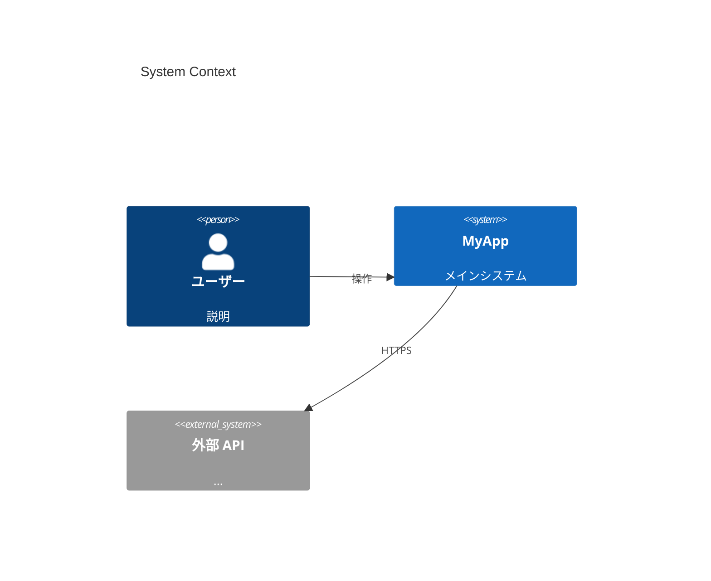
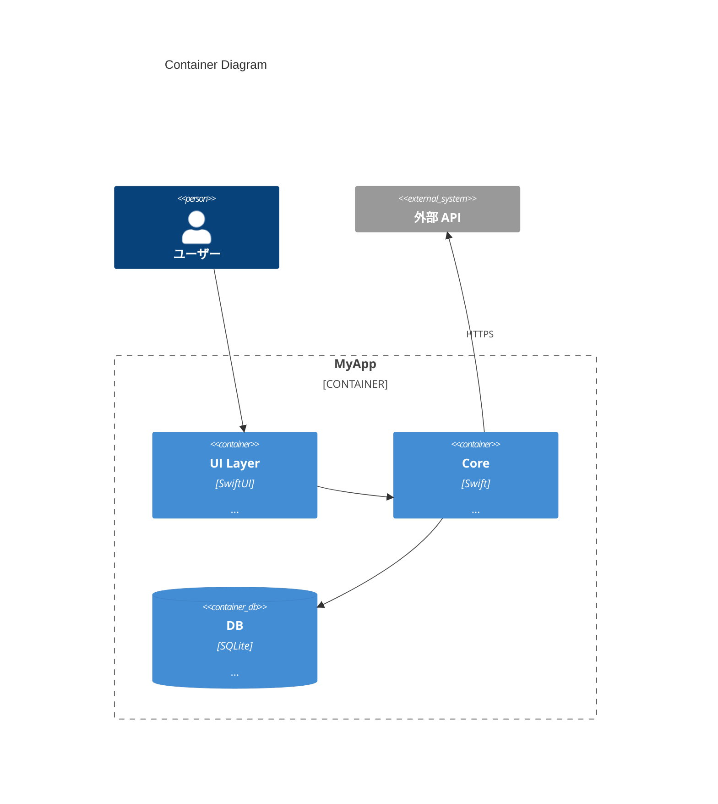
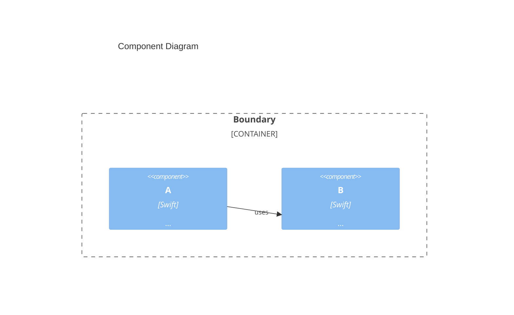
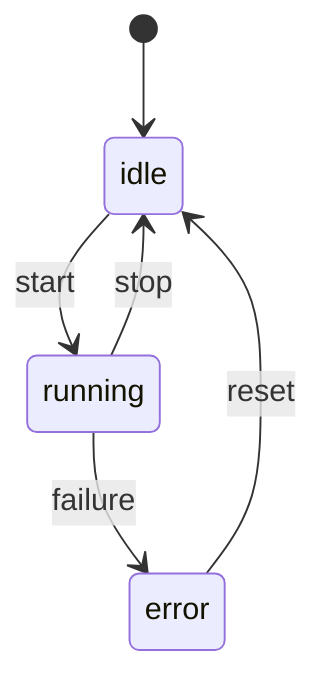
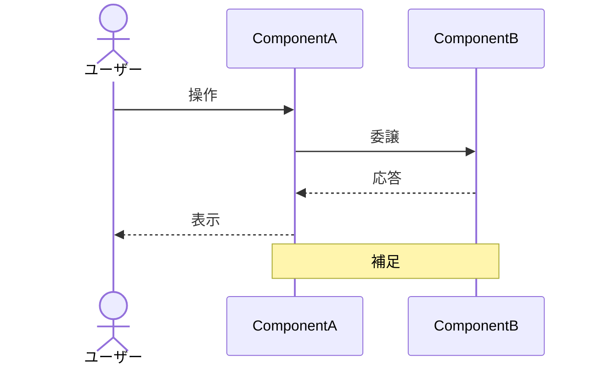
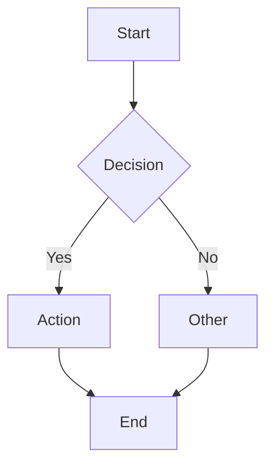
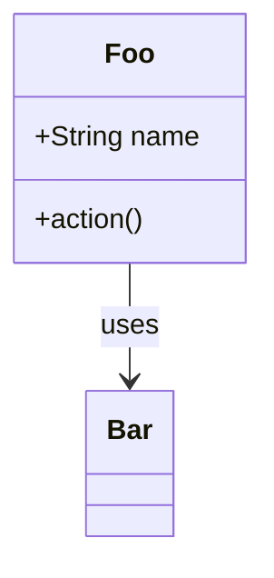
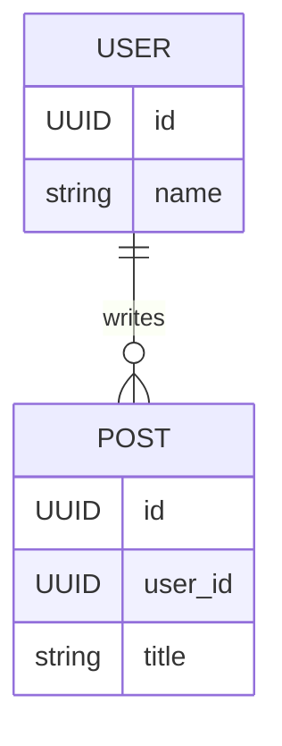

# Mermaid Cheatsheet

drive-partner / 他プロジェクトでよく使う Mermaid 記法の早見表。

## C4 Context (L1)

## C4 Container (L2)

## C4 Component (L3)

## 状態機械

## シーケンス

## フローチャート (依存・データフロー)

## クラス図 (必要時のみ)

## ER 図 (DB 構造)

## Tips

- GitHub の PR / Issue / README で **そのままレンダリング** される
- 描画が崩れる場合は VS Code の Mermaid プレビューで確認
- 複雑になりすぎたら **図を分割** するか D2 への移行を検討
